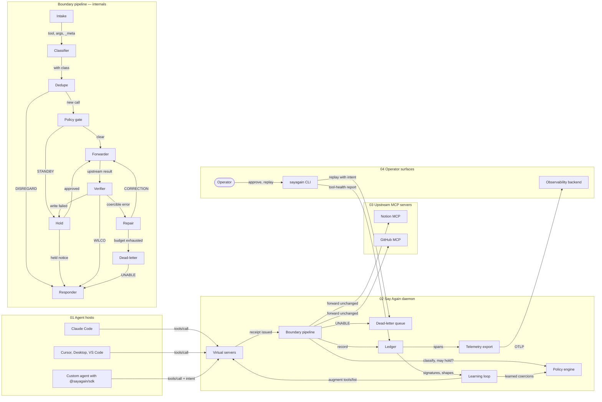
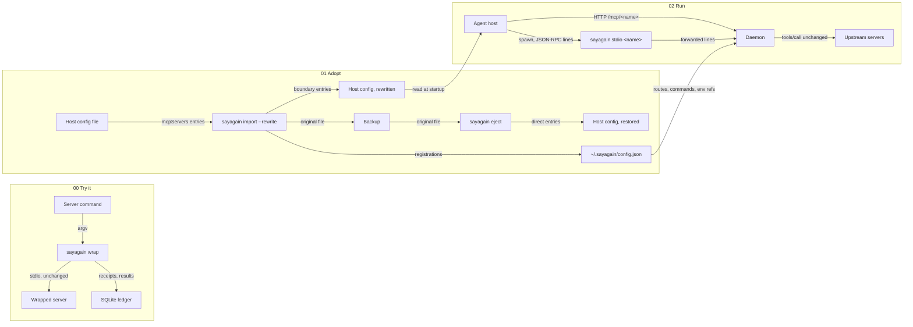
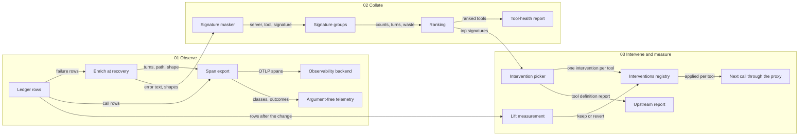
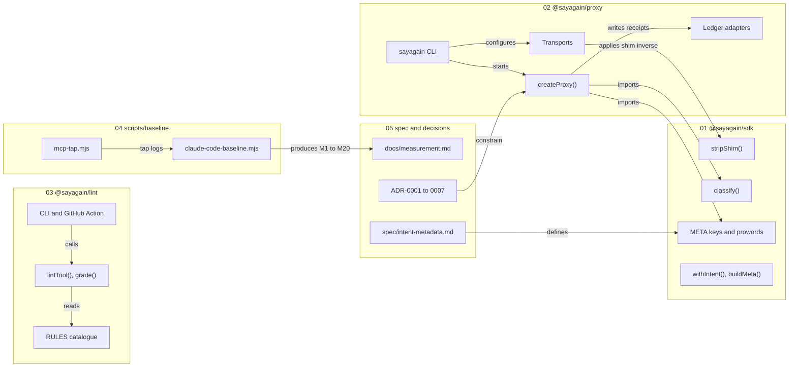

# Diagrams

Authored in Docent as tiered scenes; the
`.excalidraw` files beside this page are the sources and the Docent project
`sayagain` opens them at `docs/diagrams/<name>`. The Mermaid below is
Docent's export, kept here so the pictures render on GitHub and diff in pull
requests. When a diagram and a document disagree, the ADR wins and the
diagram gets fixed.

| Scene | Answers | Genre |
| ----- | ------- | ----- |
| `architecture` | Who talks to whom, and what happens to one call inside the boundary (dive into *Boundary pipeline*). Six call stories are declared as scenarios: WILCO, STANDBY twice, CORRECTION, UNABLE, DISREGARD. | Architecture map |
| `onboarding` | How a server gets behind the boundary and how a host finds it, without losing the server's name. ADR-0006. | Data flow |
| `learning-loop` | How ledger rows become signatures, rankings and measured interventions. ADR-0007. | Data flow |
| `packages` | What exists in the monorepo today and what is planned, with the links between them. `createProxy()` links to the pipeline internals in `architecture`. | Architecture map |

## architecture

## onboarding

## learning-loop

## packages

